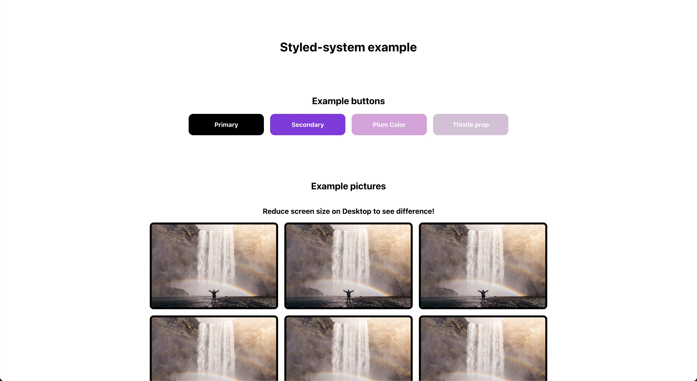

# Styled-system example

An example and introduction to [styled-system](https://styled-system.com/).

**Read the full step-by-step article: https://shellbear.me/blog/styled-system**



## Components

- [Button](src/components/Button.tsx) - Introduce usage of [Variants](https://styled-system.com/variants/)
- [Grid](src/components/Grid.tsx) - Use [Grid Layout](https://styled-system.com/api#grid-layout/) and [Responsive Styles](https://styled-system.com/responsive-styles/)
- [Image](src/components/Image.tsx) - Use the [Border](https://styled-system.com/api/#border) styles

All the components and props are used in the [src/App.tsx](src/App.tsx) component.

## 💻 Getting started

```
yarn
# or
npm install

yarn start
#or
npm start
```

Runs the app in the development mode.\
Open [http://localhost:3000](http://localhost:3000) to view it in the browser.

The page will reload if you make edits.\
You will also see any lint errors in the console.

## License

MIT
